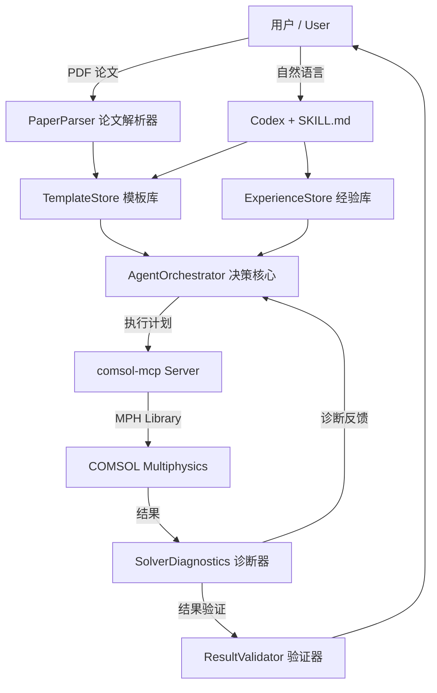

# COMSOL Agent — Full-Stack Simulation Automation Platform
# COMSOL Agent — 全栈仿真自动化平台

[](https://www.python.org/)
[](LICENSE)
[](https://modelcontextprotocol.io/)
[](https://github.com/openai/codex)

> **Let AI read your research paper and autonomously run the COMSOL simulation.**
> **让 AI 读懂你的研究论文，自主完成 COMSOL 仿真 — 自然语言驱动，论文直达结果。**

---

## 目录 / Table of Contents

- [What is this? / 这是什么？](#what-is-this--这是什么)
- [Architecture / 六层架构](#architecture--六层架构)
- [Quick Start / 快速开始](#quick-start--快速开始)
- [核心功能 / Key Features](#核心功能--key-features)
  - [1. 论文到仿真 / Paper-to-Simulation](#1-论文到仿真--paper-to-simulation)
  - [2. KnowledgeBridge 知识桥](#2-knowledgebridge-知识桥-)
  - [3. 经验学习回路 / Experience Learning](#3-经验学习回路--experience-learning)
  - [4. 模板匹配 / Template Matching](#4-模板匹配--template-matching)
  - [5. 求解器自动诊断 / Solver Auto-Diagnostics](#5-求解器自动诊断--solver-auto-diagnostics)
  - [6. ModelLearner 模型学习](#6-modellearner-模型学习-)
- [跨软件可移植性 / Cross-Software Portability](#跨软件可移植性--cross-software-portability)
- [研究领域支持 / Research Domain Support](#研究领域支持--research-domain-support)
- [路线图 / Roadmap](#路线图--roadmap)
- [许可证 / License](#许可证--license)
- [致谢 / Acknowledgments](#致谢--acknowledgments)

---

## What is this? / 这是什么？

**COMSOL Agent** 是一个六层自治仿真平台，填补了研究论文与 COMSOL Multiphysics 之间的鸿沟。

你不需要手动在 COMSOL GUI 里点击操作——只需用自然语言描述目标（或上传 PDF 论文），Agent 自动完成全部流程。

### 工作流程 / Workflow

1. **Analyze / 分析** — 从论文 PDF 中自动提取物理参数、边界条件、求解器类型
2. **Match / 匹配** — 从 YAML 模板库中模糊匹配最佳仿真"配方"
3. **Plan / 规划** — 生成分步执行计划（几何 → 物理 → 网格 → 求解 → 后处理）
4. **Build / 执行** — 通过 MCP 协议 + mph Python 库驱动 COMSOL 完成建模
5. **Diagnose / 诊断** — 求解失败时自动排查根因并给出修复建议
6. **Learn / 学习** — 每次用户纠错都被沉淀为可复用的经验条目



---

## Architecture / 六层架构

```
comsol_agent/
├── skills/
│   └── SKILL.md                   # Codex Skill — LLM 行为规范文件
├── templates/                     # 仿真模板库 / Simulation Recipe Library
│   └── photonic_crystal/
│       └── wu_hu.yaml             # Wu-Hu 拓扑光子晶体模板
├── tests/
│   ├── test_e2e.py                # 端到端测试（8/8 PASS）
│   └── test_kb.py                 # KnowledgeBridge 专项测试
├── docs/
│   └── mcp_server_template.py     # 通用 MCP Server 模板
└── src/
    ├── agent/
    │   └── orchestrator.py        # ★ 决策核心：analyze_goal → plan → diagnose → learn
    ├── knowledge/
    │   ├── template_store.py      # 模板 CRUD + 模糊匹配算法
    │   ├── paper_parser.py        # PDF 论文 → 仿真参数提取器
    │   ├── knowledge_bridge.py    # ★ KnowledgeBridge 知识桥（5 层知识源）
    │   └── experience_store.py    # 纠错记忆库 — Agent 越用越聪明
    ├── feedback/
    │   └── solver_diagnostics.py  # 求解失败诊断 + 结果验证
    ├── mcp/
    │   └── adapter.py             # MCP 工具调用适配器
    └── storage/                   # 持久化层（预留）
```

### 六层架构详解 / 6-Layer Architecture

```
+------------------+  +------------------+
| Knowledge 知识层  |  | Feedback 反馈层   |
| · TemplateStore  |  | · SolverDiagnostics|
| · PaperParser    |  | · ResultValidator |
| · ExperienceStore|  |                  |
| · KnowledgeBridge|  |                  |
+------------------+  +------------------+
         |                       |
+---------------------------------------------+
|       AgentOrchestrator Agent 决策核心        |
|  analyze_goal → get_execution_plan           |
|  → diagnose_error → learn_from_correction    |
|  → query_knowledge → knowledge_status        |
+---------------------------------------------+
|       MCP Tool Layer MCP 工具执行层           |
+---------------------------------------------+
|       Persistence Layer 持久化层              |
+---------------------------------------------+
```

---

## Quick Start / 快速开始

### 前置条件 / Prerequisites

| 组件 / Component | 用途 / Purpose |
|:--|:--|
| Python 3.10+ | 运行环境 |
| COMSOL Multiphysics 6.0+ | 仿真引擎 |
| mph >= 1.3.1 | Python ↔ COMSOL 接口 |
| Codex CLI | AI 编程助手界面 |
| comsol-mcp Server | MCP 协议服务器 |

### 安装 / Installation

```bash
# 克隆 COMSOL Agent
git clone https://github.com/fllowzle/comsol-agent.git
cd comsol-agent
pip install -e .

# 安装 mph（如果尚未安装）
pip install mph
```

### 配置 Codex MCP / Configure Codex MCP

编辑 `C:\\Users\\<用户名>\\.codex\\mcp.json`：

```json
{
  "mcpServers": {
    "comsol": {
      "command": "python",
      "args": ["-m", "src.server"],
      "cwd": "D:\\\\Program Files\\\\Claude\\\\comsol-mcp",
      "env": { "HF_ENDPOINT": "https://hf-mirror.com" }
    }
  }
}
```

### 首次仿真 / First Simulation

在 Codex 中加载 `skills/SKILL.md` 技能后：

```
用户: "帮我仿真 Wu-Hu 光子晶体的能带结构，晶格常数 a=500nm，硅柱半径 r=0.2a"

Agent:
  ✅ 分析: domain=photonic_crystal, study=eigenfrequency
  ✅ 匹配: Wu-Hu 光子晶体 模板（9 个可调参数）
  ✅ 计划: 10 步执行序列

  [开始执行...]
  ✅ COMSOL 会话已启动
  ✅ 模型已创建: comp1
  ✅ 六角晶格几何已建好
  ✅ 电磁波频域物理场已添加
  ✅ 周期性边界条件已设置 (Γ→M→K→Γ)
  ✅ 网格已生成（conformal mesh verified）
  ⏳ 正在求解本征频率...
  ✅ 求解完成: 8 个本征模
  ✅ 能带图已导出: band_structure.png
```

---

## 核心功能 / Key Features

### 1. 论文到仿真 / Paper-to-Simulation

上传 PDF 论文，Agent 自动提取仿真参数：

```python
from src.knowledge.paper_parser import parse_paper, format_for_agent

info = parse_paper(Path("wu_hu_2004.pdf"))
print(format_for_agent(info))
# Domain: photonic_crystal (confidence: medium)
# Physics: electromagnetic_waves
# Study: eigenfrequency
# Extracted: lattice_constant=500nm, permittivity=11.7, radius=0.2a
# BCs: periodic (Bloch, Brillouin)
```

**关键词词典** 定义了每个领域的论文高频词汇：
- photonic_crystal: 光子晶体, photonic crystal, band gap, Bloch mode...
- plasmonic: 表面等离激元, surface plasmon, SPP, LSPR...
- polariton: 激子极化激元, exciton-polariton, Rabi splitting, strong coupling...
- metasurface: 超表面, metasurface, meta-atom, phase gradient...

### 2. KnowledgeBridge 知识桥 ★

连接 Agent 与 COMSOL 知识库（位于 `D:\\Program Files\\Claude\\comsol-mcp`）。五层知识源统一查询：

| 优先级 | 来源 / Source | 内容 / Content |
|:--:|------|------|
| 1 | **ExperienceStore** 经验库 | 用户纠错积累的实战经验（9 条已存储） |
| 2 | **TemplateStore** 模板库 | 模板自带的注意事项和常见陷阱 |
| 3 | **Embedded Markdown** 嵌入式指南 | `mph_api.md` — MPH 库参考<br>`physics_guide.md` — 物理场设置指南<br>`workflow.md` — 完整工作流 |
| 4 | **Physics Topic Guides** 物理专题 | 结构化配置：photonic_crystal, polariton, plasmonic, semiconductor |
| 5 | **PDF Vector Search** PDF 语义搜索 | ChromaDB 向量索引<br>**51 个** COMSOL 模块 PDF<br>394.4 MB 向量数据库<br>Semiconductor_Module, Wave_Optics, RF, ACDC, CFD… |

```python
from src.knowledge.knowledge_bridge import KnowledgeBridge

kb = KnowledgeBridge()

# 综合查询（按优先级合并结果）
result = kb.query("如何设置周期性边界条件中的 k 向量扫描？", domain="photonic_crystal")
# → 经验库: "在 Eigenfrequency 求解之前必须先添加 PeriodicCondition"
# → 模板注释: "k-path 从 Γ 点到 K 点再到 M 点"
# → PDF 语义搜索: "Wave_Optics_Module.pdf §3.2 Bloch-Floquet theory..."

# 查看完整知识库状态
status = kb.knowledge_status()
# 输出：51 个 PDF 模块列表、4 个物理专题、3 个嵌入式指南
```

**为什么需要 KnowledgeBridge？**

COMSOL 模块众多（Wave Optics、Semiconductor、RF、AC/DC、CFD、Heat Transfer…50+ 个模块），
即使是经验丰富的用户也不可能记住所有模块的参数设置和最佳实践。
KnowledgeBridge 让 Agent **自动查阅官方手册**，配合用户的历史经验，显著降低"忘了设边界条件"这类错误。

### 3. 经验学习回路 / Experience Learning

每次用户纠错都变成可复用的经验条目，Agent 越用越聪明：

```python
agent.learn_from_correction(
    domain="photonic_crystal",
    trigger="forgot PeriodicCondition",
    symptom="negative eigenvalues",
    fix="add PeriodicCondition + k-vector BEFORE solving",
)
# 下次在 photonic_crystal 领域仿真时自动应用此修复

# 经验库自动持久化到 experience_store.json（已有 9 条经验）
```

**经验示例 / Example Experiences：**

| ID | 领域 | 触发条件 | 症状 | 修复方案 |
|:--|:--|:--|:--|:--|
| 1 | photonic_crystal | 忘记 PeriodicCondition | 负本征值 | 求解前先添加 PeriodicCondition |
| 2 | photonic_crystal | k 向量未扫描 | 能带不连续 | 使用 Parametric Sweep 扫描 k-path |
| 3 | electromagnetic | PML 设置错误 | 反射波干扰 | 检查 PML 层数和 scaling factor |
| ... | ... | ... | ... | ... |

### 4. 模板匹配 / Template Matching

计分制模糊匹配算法自动找到最佳仿真配方：

| 查询 / Query | 得分 / Score | 匹配结果 / Match |
|-------------|:--:|-------------|
| domain=photonic_crystal, physics=electromagnetic | 3+2=5 ★ | Wu-Hu template |
| domain=plasmonic, physics=electromagnetic | 3+2=5 | 需新建模板 |
| domain=polariton | 3 | 需新建模板 |

**YAML 模板结构示例** (`templates/photonic_crystal/wu_hu.yaml`)：

```yaml
name: "Wu-Hu Topological Photonic Crystal"
name_zh: "Wu-Hu 拓扑光子晶体"
domain: photonic_crystal
physics: electromagnetic_waves
study: eigenfrequency
parameters:
  lattice_constant: 500nm       # 晶格常数
  radius: 0.2a                  # 柱半径
  epsilon: 11.7                 # 介电常数（硅）
  height: 220nm                 # 柱高度
geometry:
  type: hexagonal_lattice       # 六角晶格
  unit_cell: rhombus            # 菱形原胞
  perturbation: wu_hu           # Wu-Hu 扰动模式
boundary_conditions:
  - type: PeriodicCondition     # 周期性边界条件
    k_path: [Γ, M, K, Γ]       # 布里渊区路径
  - type: FloquetPeriodicity    # Floquet 周期性
mesh:
  type: physics_controlled
  element_size: finer
solver:
  type: Eigenfrequency
  num_eigenvalues: 8
  search_around: 0.5            # 搜索频率附近
```

### 5. 求解器自动诊断 / Solver Auto-Diagnostics

6 种 COMSOL 常见错误模式自动识别：

```python
diagnosis = agent.diagnose_error("Singular matrix detected", domain="photonic_crystal")
# {
#   "cause": "Singular matrix - insufficient boundary conditions",
#   "fixes": [
#     "Check that all degrees of freedom are constrained",
#     "Set search_around parameter for Eigenfrequency study",
#     "Verify PeriodicCondition is properly applied"
#   ],
#   "relevant_experiences": [
#     "经验 #1: 求解前先添加 PeriodicCondition",
#     "经验 #2: 使用 Parametric Sweep 扫描 k-path"
#   ]
# }
```

| 错误模式 / Error Pattern | 根因 / Root Cause | 修复建议 / Fix |
|:--|:--|:--|
| Singular matrix | 边界条件不完整 | 检查约束、添加 PeriodicCondition |
| Failed to converge | 网格质量或初始值 | 细化网格、调整 search_around |
| Negative eigenvalues | 缺少周期性条件 | 先设 PeriodicCondition 再求解 |
| Out of memory | 网格过密 | 增大 element_size |
| Incompatible BC | BC 冲突 | 检查边界选择 |
| Parametric sweep failed | 参数扫描异常 | 增加 sweep 步数 |

### 6. ModelLearner 模型学习 ★

从已有的 COMSOL `.mph` 文件或 Python 脚本（AST 解析）中**自动提取**仿真模板：

```python
from src.knowledge.template_store import TemplateStore

store = TemplateStore()

# 从 .mph 文件学习
store.learn_from_mph("my_photon_crystal.mph", domain="photonic_crystal")
# → 自动提取：几何参数、物理场设置、边界条件、网格配置
# → 输出：templates/photonic_crystal/my_photon_crystal.yaml

# 从 Python 脚本学习（AST 解析 mph 脚本）
store.learn_from_python("wu_hu_model.py", domain="photonic_crystal")
# → 解析 model.component().geom().create() 等 mph API 调用
# → 提取关键参数并生成 YAML 模板

# 查看所有已学习的模板
templates = store.list_templates()
# ['photonic_crystal/wu_hu', 'photonic_crystal/my_photon_crystal', ...]
```

**这意味着你可以直接喂入已有的 COMSOL 模型文件，Agent 会自动"学会"如何设置这类仿真。**

---

## 跨软件可移植性 / Cross-Software Portability

COMSOL Agent 的 `src/core/` 层是 **100% 软件无关的**。适配其他仿真软件只需替换上层封装：

| 模块 / Module | 复用率 | 适配方式 / How to Adapt |
|:--|:--:|:--|
| `core/template_store.py` | **100%** | 换 YAML 模板内容即可 |
| `core/experience_store.py` | **100%** | 无需任何改动 |
| `core/paper_parser_base.py` | 80% | 覆盖领域关键词词典 |
| `agent/orchestrator.py` | 95% | 几乎无需改动 |
| `knowledge/knowledge_bridge.py` | 80% | 调整知识源路径和 PDF 映射 |
| `feedback/solver_diagnostics.py` | 30% | 覆盖错误模式库（每种软件错误不同） |
| `mcp/adapter.py` | 0% | 新建 `{软件名}-mcp` Server |

**参见：** [sim-agent-platform](https://github.com/fllowzle/sim-agent-platform) — 通用 Agent 生成平台，
通过 7 步向导即可为**任意**仿真软件生成完整 Agent。

---

## 研究领域支持 / Research Domain Support

| 领域 / Domain | 状态 / Status | 可用模板 / Templates | 知识库支持 |
|:--|:--:|:--|:--:|
| **光子晶体 / Photonic Crystals** | ✅ 就绪 | Wu-Hu 拓扑光子晶体 | Wave_Optics_Module PDF |
| **极化激元 / Polariton** | 🔧 待扩展 | 需新建 | **已含** Semiconductor_Module + Wave_Optics PDF |
| **激子 / Exciton** | 🔧 待扩展 | 需新建 | **已含** Semiconductor_Module PDF |
| **等离激元 / Plasmonic** | 🔧 待扩展 | 需新建 | Wave_Optics + RF_Module PDF |
| **超表面 / Metasurface** | 🔧 待扩展 | 需新建 | Wave_Optics_Module PDF |
| **微流控 / Microfluidics** | 🔧 待扩展 | 需新建 | CFD_Module + Microfluidics_Module PDF |

> **研究生方向提示**: 如果你的研究涉及极化激元/激子，Semiconductor_Module 和 Wave_Optics
> 的 PDF 已在知识库中，只需新建对应的 YAML 模板和论文关键词即可复用整个平台。

---

## 路线图 / Roadmap

- [x] Agent 六层架构
- [x] YAML 模板系统
- [x] 论文解析器（PDF → 仿真参数）
- [x] 经验学习回路
- [x] 求解器自动诊断（6 种错误模式）
- [x] Codex MCP 集成（SKILL.md）
- [x] 端到端测试套件（8/8 PASS）
- [x] **KnowledgeBridge 知识桥**（5 层知识源，51 个 PDF 模块，394.4 MB 向量索引）
- [x] **ModelLearner 模型学习**（.mph + .py → YAML 模板）
- [ ] 更多物理场模板（polariton, plasmonic, metasurface, microfluidics…）
- [ ] 图像结果对比（仿真 vs 论文图，自动化验证）
- [ ] 多模型并行优化（参数扫描 + 遗传算法）
- [ ] Web UI（非编程用户界面）

---

## 许可证 / License

MIT — 随意使用、修改、分发。

---

## 致谢 / Acknowledgments

- [COMSOL Multiphysics MCP](https://github.com/wjc9011/COMSOL_Multiphysics_MCP) by wjc9011 — COMSOL MCP 服务器
- [MPH](https://github.com/MPh-project/MPh) — Python ↔ COMSOL 接口库
- [FastMCP](https://github.com/jlowin/fastmcp) — MCP 服务器框架
- [Codex](https://github.com/openai/codex) — OpenAI 的 AI 编程代理
- [ChromaDB](https://www.trychroma.com/) — 向量数据库（知识库底层引擎）
