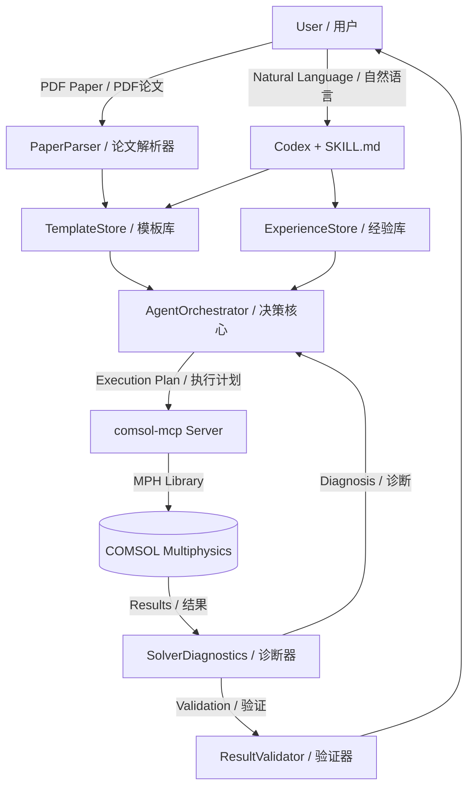

# COMSOL Agent — Full-Stack Simulation Automation Platform
# COMSOL Agent — 全栈仿真自动化平台

[](https://www.python.org/)
[](LICENSE)
[](https://modelcontextprotocol.io/)
[](https://github.com/openai/codex)

> Let AI read your research paper and autonomously run the COMSOL simulation — from geometry to band structure, all via natural language.
> 让 AI 读懂你的研究论文，自主完成 COMSOL 仿真 — 从几何建模到能带图，全程自然语言交互。

---

## What is this? / 这是什么？

**COMSOL Agent** is a 6-layer autonomous simulation platform that bridges the gap between research papers and COMSOL Multiphysics. Instead of manually clicking through the COMSOL GUI, you describe your goal in natural language (or upload a PDF paper), and the Agent:

**COMSOL Agent** 是一个 6 层自治仿真平台，填补了研究论文与 COMSOL Multiphysics 之间的鸿沟。你不必手动在 COMSOL GUI 中操作，只需用自然语言描述目标（或上传 PDF 论文），Agent 会：

1. **Analyze / 分析** — 从论文中提取物理参数、边界条件、求解器类型
2. **Match / 匹配** — 从模板库中自动匹配最佳仿真"配方"
3. **Plan / 规划** — 生成分步执行计划（几何→物理→网格→求解→后处理）
4. **Build / 执行** — 通过 MCP 协议驱动 COMSOL 完成建模
5. **Diagnose / 诊断** — 求解失败时自动排查根因并给出修复建议
6. **Learn / 学习** — 每次用户纠错都被沉淀，下次自动应用



---

## Architecture / 架构

```
comsol_agent/
├── skills/
│   └── SKILL.md                   # Codex Skill — tells LLM how to be a COMSOL Agent
│                                  # Codex 技能文件 — 教 LLM 如何扮演 COMSOL Agent
├── templates/                     # Simulation recipe library / 仿真配方库
│   └── photonic_crystal/
│       └── wu_hu.yaml             # Wu-Hu topological photonic crystal template
├── docs/
│   └── mcp_server_template.py     # Template for creating new software MCP servers
│                                  # 新建其他软件 MCP Server 的模板
├── tests/
│   └── test_e2e.py                # End-to-end tests (8/8 PASS) / 端到端测试
└── src/
    ├── agent/
    │   └── orchestrator.py        # Decision core: analyze→plan→diagnose→learn
    │                              # 决策核心：分析→规划→诊断→学习
    ├── knowledge/
    │   ├── template_store.py      # Template CRUD + fuzzy matching algorithm
    │   ├── paper_parser.py        # PDF paper → simulation parameters extractor
    │   └── experience_store.py    # Correction memory — Agent gets smarter over time
    │                              # 纠错记忆 — Agent 越用越聪明
    ├── feedback/
    │   └── solver_diagnostics.py  # Solver failure diagnosis + result validation
    │                              # 求解失败诊断 + 结果验证
    ├── mcp/
    │   └── adapter.py             # MCP tool caller for local testing
    └── storage/                   # Persistence layer (reserved)

6-Layer Architecture / 6 层架构:
+------------------+  +------------------+
| Knowledge / 知识层 |  | Feedback / 反馈层 |
| TemplateStore     |  | SolverDiagnostics|
| PaperParser       |  | ResultValidator  |
| ExperienceStore   |  |                  |
+------------------+  +------------------+
         |                       |
+----------------------------------------+
|     AgentOrchestrator / Agent 决策核心   |
+----------------------------------------+
|     MCP Tool Layer / MCP 工具执行层      |
+----------------------------------------+
|     Persistence Layer / 持久化层         |
+----------------------------------------+
            |          |
    [Codex SKILL.md]  [User / 用户]
```

---

## Quick Start / 快速开始

### Prerequisites / 前提条件

- **COMSOL Multiphysics** 5.x or 6.x with LiveLink
- **Python** 3.10+ (NOT Windows Store version)
- **Java Runtime** (required by MPh/COMSOL)
- **Codex Desktop** (for AI agent interaction)

### Installation / 安装

```bash
# 1. Clone this repository
git clone https://github.com/YOUR_USERNAME/comsol-agent.git
cd comsol-agent

# 2. Install dependencies
pip install -e .

# 3. Install and configure comsol-mcp
cd /path/to/comsol-mcp
pip install -e .

# 4. Verify
cd comsol-agent
python tests/test_e2e.py
# Expected: RESULTS: 8/8 passed
```

### Configure Codex MCP / 配置 Codex MCP

Add to `C:\Users\YOUR_NAME\.codex\mcp.json` / 添加到 MCP 配置文件：

```json
{
  "mcpServers": {
    "comsol": {
      "command": "python",
      "args": ["-m", "src.server"],
      "cwd": "D:\\Program Files\\Claude\\comsol-mcp",
      "env": { "HF_ENDPOINT": "https://hf-mirror.com" }
    }
  }
}
```

### First Simulation / 首次仿真

In Codex, after loading the SKILL.md skill / 在 Codex 中加载 SKILL.md 技能后：

```
You: "帮我仿真 Wu-Hu 光子晶体的能带结构，晶格常数 a=500nm，硅柱半径 r=0.2a"

Agent:
  分析: domain=photonic_crystal, study=eigenfrequency
  匹配: Wu-Hu 光子晶体 模板 (9 个可调参数)
  计划: 10 步执行序列
  
  [开始执行...]
  ✅ COMSOL 会话已启动
  ✅ 模型已创建: comp1
  ✅ 六角晶格几何已建好
  ✅ 电磁波频域物理场已添加
  ✅ 周期性边界条件已设置 (Γ→M→K→Γ)
  ✅ 网格已生成 (conformal mesh verified)
  ⏳ 正在求解本征频率...
  ✅ 求解完成: 8 个本征模
  ✅ 能带图已导出: band_structure.png
```

---

## Key Features / 核心特性

### 1. Paper-to-Simulation / 论文到仿真

Upload a PDF and the Agent extracts simulation parameters automatically.
上传 PDF 论文，Agent 自动提取仿真参数。

```python
from src.knowledge.paper_parser import parse_paper, format_for_agent

info = parse_paper(Path("wu_hu_2004.pdf"))
print(format_for_agent(info))
# Domain: photonic_crystal (confidence: medium)
# Physics: electromagnetic_waves
# Study: eigenfrequency
# Extracted: lattice_constant=500nm, permittivity=11.7, radius=0.2a
# BCs: periodic (Bloch, Brillouin)
```

### 2. Experience Learning / 经验学习

Each user correction becomes a reusable experience entry.
每次用户纠错都变成可复用的经验条目。

```python
agent.learn_from_correction(
    domain="photonic_crystal",
    trigger="forgot PeriodicCondition",
    symptom="negative eigenvalues",
    fix="add PeriodicCondition + k-vector BEFORE solving",
)
# Next simulation in photonic_crystal domain auto-applies this fix
```

### 3. Template Matching / 模板匹配

Fuzzy scoring algorithm matches papers to the best simulation recipe.
计分制模糊匹配算法自动找到最佳仿真配方。

| Query / 查询 | Score / 得分 | Match / 匹配 |
|-------------|-------------|-------------|
| domain=photonic_crystal, physics=electromagnetic | +3 +2 = 5 | Wu-Hu template |
| domain=plasmonic, physics=electromagnetic | +3 +2 = 5 | (needs new template) |
| domain=polariton | +3 | (needs new template) |

### 4. Solver Auto-Diagnostics / 求解器自动诊断

```python
diagnosis = agent.diagnose_error("Singular matrix detected", domain="photonic_crystal")
# {
#   "cause": "Singular matrix - insufficient boundary conditions",
#   "fixes": ["Check constraints", "Set search_around for Eigenfrequency", ...],
#   "relevant_experiences": ["use PeriodicCondition before solving", ...]
# }
```

---

## Cross-Software Portability / 跨软件可移植性

This architecture is **software-agnostic**. To adapt for ANSYS, Lumerical, or any other simulation tool:
本架构是**软件无关的**。适配 ANSYS、Lumerical 或任何其他仿真工具只需：

| Component / 组件 | Reusability / 复用率 | What to change / 需要改的 |
|-----------------|---------------------|-------------------------|
| TemplateStore | 100% / 完全复用 | Just swap YAML content / 只换 YAML 模板内容 |
| PaperParser | 80% | Add domain keywords / 加几行领域关键词 |
| ExperienceStore | 100% / 完全复用 | Nothing / 不用改 |
| AgentOrchestrator | 95% | Nothing / 不用改 |
| SolverDiagnostics | 30% | Update error patterns / 更新报错关键词 |
| MCP Server | 0% | New `{software}-mcp` server / 新建 MCP Server |

See `docs/mcp_server_template.py` for a minimal MCP server template.
参见 `docs/mcp_server_template.py` 获取 MCP Server 最小模板。

---

## Roadmap / 路线图

- [x] Agent 6-layer architecture / Agent 6 层架构
- [x] Template system (YAML-based) / 模板系统（基于 YAML）
- [x] Paper parser (PDF → parameters) / 论文解析器（PDF → 参数）
- [x] Experience learning loop / 经验学习回路
- [x] Solver diagnostics / 求解诊断器
- [x] Codex MCP integration / Codex MCP 集成
- [x] E2E test suite (8/8) / 端到端测试套件
- [ ] More physics templates (polariton, plasmonic, metasurface...)
- [ ] Image-based result comparison (sim vs paper figures)
- [ ] Multi-model parallel optimization
- [ ] Web UI for non-programmer users

---

## License / 许可证

MIT — 随意使用、修改、分发。

---

## Acknowledgments / 致谢

- [COMSOL Multiphysics MCP](https://github.com/wjc9011/COMSOL_Multiphysics_MCP) by wjc9011 — MCP server for COMSOL
- [MPH](https://github.com/MPh-project/MPh) — Python library for COMSOL
- [FastMCP](https://github.com/jlowin/fastmcp) — Fast MCP server framework
- [Codex](https://github.com/openai/codex) — AI coding agent by OpenAI
